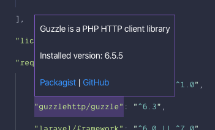

# Composer Links VS Code Extension

This extension shows information about installed packages when you hover over them in your `composer.json` file.

You can see the description, exact installed version, and links to Packagist and GitHub.
